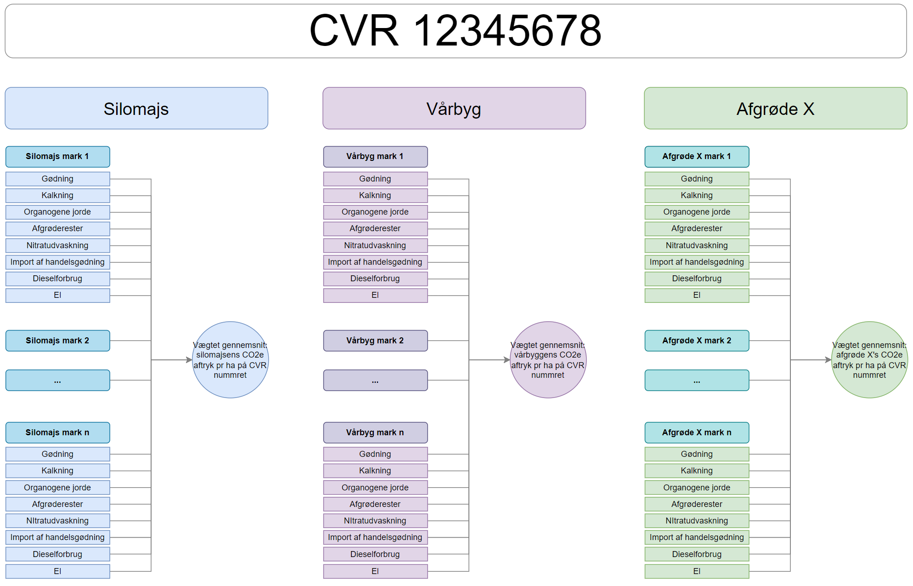

# **Produktregnskab for afgrøder**

## **Intro**
_Fagligt notat kan læses [HER](https://seges.sharepoint.com/sites/GreenAction/Delte%20dokumenter/General/Produktregnearks/skh20220215_Datagrundlag_klimaregnskab_planteprodukter.docx?web=1)_

## **Beregninger**

Når vi kender klimaftrykket på den enkelte mark, kan produktaftrykket pr ha findes ved at summere aftrykket fra marker med samme type afgrøde, og dividere med disses samlede antal hektar. 

Se Fig 1 for et grsfisk overblik over hvilke

## **Beregning af afgrødens produktaftryk**
Af fig. 1 ses hvordan produktaftrykket udregnes for en given afgrøde. Generelt kan produktaftrykket, P, for en afgrøde, a, skrives som:

$$P_a = \frac{\sum_{j=1}^{m_a} \sum_{i=1}^{n_a} CO_2e_{j,i}}{A_a}$$

Hvor: 

* na: antallet af udledningskilder inkluderet i beregningen for marken med afgrøde a
* ma: antallet af marker hvor afgrøde a dyrkes
* Aa: det samlede areal hvorpå afgrøde a dyrkes = summering af data fra MO
* CO2ej,i: CO2e udledningen fra den i'te emissionskilde på den j'te mark

Beregningerne af de enkelte emissionskilder findes i:

1. [Gødning mark (fra afgræsning + handels-, husdyr- og anden organisk)](https://github.com/segesdk/ESGT_formler/blob/main/Marker/G%C3%B8dning_og_nitrifikationsh%C3%A6mmer.ipynb)
2. [Kalkning](https://github.com/segesdk/ESGT_formler/blob/main/Marker/Kalkning.ipynb)
3. [Organogene jorde](https://github.com/segesdk/ESGT_formler/blob/main/Marker/Organogene_jorde.ipynb)
4. [Afgrøderester](https://github.com/segesdk/ESGT_formler/blob/main/Marker/Afgr%C3%B8derester.ipynb)
5. [Nitratudvaskning](https://github.com/segesdk/ESGT_formler/blob/main/Marker/Nitratudvaskning.ipynb)
6. [Handelsgødning import](https://github.com/segesdk/ESGT_formler/blob/main/import/handelsg%C3%B8dning.md)
7. Afgræsning (mangler afklaring/beregning)
8. [Dieselforbrug og maskinarbejde](https://github.com/segesdk/ESGT_formler/blob/main/import/Diesel.md)
9. [El til tørring og vanding](https://github.com/segesdk/ESGT_formler/blob/main/import/el.md)

### **Eksempelberegning**

På CVR 12345678 findes tre marker med vårbyg:

* Mark 1 = 40 ha vårbyg
* Mark 2 = 180 ha vårbyg
* Mark 3 = 80 ha vårbyg

Samlet udledning for marker med vårbyg, CO2eVårbyg:

$$CO_2e_{Mark1} = CO_2e_{Gødning} + CO_2e_{Kalkning} \dots + CO_2e_{El} $$

$$CO_2e_{Mark2} = CO_2e_{Gødning} + CO_2e_{Kalkning} \dots + CO_2e_{El} $$

$$CO_2e_{Mark3} = CO_2e_{Gødning} + CO_2e_{Kalkning} \dots + CO_2e_{El} $$

$$CO_2e_{Vårbyg} = CO_2e_{Mark1} + CO_2e_{Mark2} + CO_2e_{Mark3} $$

Produktaftryk, P, for vårbyg:

$$P_{Vårbyg} = \frac{CO_2e_{Vårbyg}}{40+180+80}$$

---
Fig 1: _Emissionskilder og beregningsrækkefølge for markens produktaftryk_. Klik [HER](https://viewer.diagrams.net/?tags=%7B%7D&highlight=0000ff&edit=_blank&layers=1&nav=1&title=produktaftryk_mark_flowchart#R7Z1rc6M2FIZ%2FjaefNoMECPwxt71M99I2M9vtR2JkTIIhxTiX%2FvoKI%2BzYwhbtAkcimp3ZNQLb8jl6WOmV9DKxL5fPH%2FLgYfElC2kywVb4PLGvJhjbDkHsn7LkpSpBjuVWJVEeh7xsV3AT%2F0N5ocVL13FIV3sXFlmWFPHDfuEsS1M6K%2FbKgjzPnvYvm2fJ%2Frc%2BBBEVCm5mQSKW%2FhmHxaIq9bG3K%2F9I42hRfzMi0%2BrMMqgv5r9ktQjC7OlVkX09sS%2FzLCuqV8vnS5qU0avjUr3v%2FZGz24rlNC3avCFaoIubz3dXOX5%2FbRX0938Su3hHqk95DJI1%2F8HfJ5f25JxEBS3K8FMW1uUqjdlXnJcXbs66%2Be1LxE6tWMnlN0zLWM%2BL%2FOW%2BrFDO%2FloE5avq2vKa73%2Bwv9P1cpmXn7qJRvFSh5hVk2WTHVw8LeKC3jwEs%2FLME2tRrGxRLBN2hNjLYPVQpXgeP1P2qy7mWVq8D5ZxUraujzR5pEU8C%2FgJ3pYQ5seXWZLlrCCk82CdFOXnJXGUspIZiyBlpy5WRZ7d0%2FrCCbanxLMDUn5AnCSvyikKXeqxch4%2Bmhf0%2BWhe0DbbjBOaLSkLFbuEv8G3%2FDPMoeCUuLZ3xkuedo0O1Uws9hocLwx4Q4%2B2X7BrC%2BwFbw7%2FoWl4QtOYYLKJWxnNvRSSv9dZfeLdahP3srFg9%2BF5E6P6PHsVlf9%2B37Wi%2BjNZFauPra4QGkmerdOwTPqmJUgayrFsHc9vB3l0bSGP2LKELNreVMwi6SuJtiviFrIbHD%2FM8mKRRVkaJNe70otdrC12tLvmc5Y98Ajf0aJ44YQF6yI7iP8OPxaRhrizNs%2F%2BsDMstvnLD%2F5Nm4O%2FyoMztz68en598uqFH1W%2Fqvwpp7PFfnm2zmf0VIj4PbAI8ogWsnulmP6cJkERP%2B5XpPtEinfqDyVFF36Yxml0ghdLWV6mh7zY5cHhXc9tuOvh3njxDC8yXnwtePEFXn4NkvsRseIQaFamhhUJK46lAyt1LV%2Bx8i2PgjRjXfyyb3%2BX5SEdCTWe2CMblhoHCZE01ByECGtBDRaoOZ9HOe%2BU0ZyuykHlOKiZOtDU2IYaGTWOFtQ4AjVf4yIPinX4GKxG1D9zkA%2FNjBn7S5nRYuzviGP%2FT8sHlpuN7rqRW1nOklU0OkHAqf%2BThYPICAJSiLQQBBxRELiK6Yom8yy%2FzddjAYZAqwKOUQVkwLhaqAKuqApcJyOhZAqtArggKsD%2Fbfvt6eqSEi1UgLqWo56X8ZDfNB89LDEgCoBexGihALiiAjCumRnPwfC0gIz99aJFi7G%2FK479xzo34xECzw3IcF8vbrQY7rvicH%2BsszPe1ILnxoz6ZdwQLUb9RBz1f%2F00xvkZHzng1BCjAkip0UIFqGv59mZofBteGiBGGpBipIU0QERpYIRzND6B1weI0QekyAylD%2FC3%2FpbFm201vOEQX2g4U%2BTtf0r1G%2FgbD1rEtiY%2F0UhE7WEsM0C%2B37jDalAGEXKF%2BFY75RC2HZd4%2FolYt9gFtd1wWOYlSoLVir9e3dNitqgPjrL0ijqCD3K320QX5UEY0932ujRLq3tFwVp%2FltY3C1bLuCiDP7W6Sapv7Se0YUbPthrS6W0T30NCRdFhb6ubtQzyco%2Bk2O3%2Fme1toTWjFIsxFzLrEhd5tM4s%2F3LUD2DYb4mX3R9e03bZSMefDeK37nL0lw%2Bslbba%2Fr7YYZ8DYS3E1W01ZWjh8aPlui3XkvQIFoj4CgOIrYWKuq3mK0DOzs7GTwOxPGAasGUfuTcd87QI5rt5IXb44xdtbC3kBhY%2BvrVJg4EFG3b5odNNT5z9x47OPAUdLLAl6kmdeVicH7SaIYwstlk7nucu8mlZQj7hnSywBSJZaTXFiK22mhW%2FS0L9%2F7it6BDLJgejBh9SA%2B9ngS2zf0VOTdtBFzg1A5laABID7mqBLbOURUoMajsKgyYGieOwnpdPArID7m3B%2BvKGHSk7WBd2sMBOz0soAdkBd7jAyFhcyNlpu4wFnJ2BbS7gyIH3ucDIKANycnRRBhC02QUgSuBuFxgZuUCOki5yQcNylP6WUwJiA%2B55gZHRDKTYYF00AyxqBh0vewRkBdz5YtditFgGBLL0GGNdNIK6ouOex1HB%2FwJjs8tFzo0u%2BgAeyAQDkBkFXDAwNttc5Mzoogzgwa0wAOlRwAsD67VgG4geXcSAhiXbo53NUcERA8OsytZLE2i9mhuanob13L3aYsCxo4IvBraNRiBnRxeNoK7oG5zRUcEdA9tGOJDDpItwYA9pkQEIjgIeGRjm4ZmagTOcesDfeuCTgZArtJ6hjTJww9M5RzNlpIJVBrbFpxG%2FCWeFpoTAWyvghqdrivvh%2BvFXuLWoTUmLnFiU3e78gXKigsEChnkgp1YGC7j1EzmhO3oND%2BU8jhh%2BA4jBGy1gmGd3AoGii7zQ8BzOrq0W1ARCAa8FR%2FRaOH6T6rZvpmZOFOibNTxh87T%2FxSpOsmVwt6LpiIwvyMynt%2FOGLn1A%2Ffmsm9GSXSdWKdOL%2BrGffZhe3PCmMojZRZ2p47ntIIcHNoIK%2BFzUO6DNvOGJGHltOyfV3RCucyLqFv2tjxwGGLQHjAIWF47ok2qAOYzRVBdgRNPOfhZGgsAC725Rf5uB5USMkCaw1BUdcEUkCDbwxhb1Yz4NNidiZOuCzWnVoo%2BlkCDYwHta1M%2F6NNiciJGrCzaisNCvpwUENArYWbhGAJBDo4sA4IoCwMCLH0EogneycI0qIKdIF1XAFVWBHlc9ghADb2JBjDQgJYboIg0QURroekUiCCbw%2FhX1sz71WGUFsyqY6CIFEFEKGNf8jBLWFQREBtAMGV1kACLKAOOZoVHCtYKACACa4aKLAEBEAWCMczRKGFYQkDG%2FZuDoMuYn4ph%2FjLM0SnhVeGboLwXH02Xo74lD%2F369KiCwUcKmwjNSgBwbXaQAT5QC3sBMjRIOFZ7RB%2BQc6aIPeKI%2BMLK5GiXMKTwjEsiZGU4k4G89MKfYGllBGVN4ovowhmkgJTwpPNEEYbc%2FqqdNjygM59ZEvukRWZ49pTV4HW56PEiEAvsdPVEnENPQsQeFamlQwn7CBxER9LKfqPOmfC%2BuruhJqsTh76ioUsBxwgdRGIDY0EUp8EWloHPHCdVY6NNsgh3mWbnPfNf1ZfFZfMlCWl7xLw%3D%3D) for at se billedet i fuld opløsning

